# VittaSys

Sistema web de gestão com **Laravel 12 + Filament 5**, com operação principal em:
- Gestão de produtos em Blade
- PDV/Caixa com integração ao banco
- Dashboard administrativo em `/admin`

## Stack atual
- PHP 8.2+
- Laravel 12
- Filament 5
- Blade + Alpine.js
- Tailwind CSS (Vite)

## Funcionalidades implementadas (hoje)

### 1. Autenticação web
- Login, registro e logout via páginas Blade
- Área de perfil (`/perfil`)

### 2. Gestão de produtos (Blade)
- CRUD completo em `/produtos`
- Estrutura por lotes (lote, validade, preço de custo e quantidade)
- Campo de imagem mantido em `produtos`
- Visualização de lote atual por produto

### 3. PDV / Caixa (`/caixa`)
- Abertura automática de caixa para usuário autenticado (quando não há caixa aberto)
- Busca de produtos por nome, ID e SKU (quando coluna existir)
- Finalização de venda com validações
- Registro de itens vendidos e pagamentos
- Resumo de caixa em tempo real
- Interface preparada para métodos de pagamento (dinheiro, pix, crédito, débito, crediário)

### 4. Serviços de domínio
- `PagamentoServico`
- `InventarioService`
- `ReportService`
- `SaldoService`
- `StripePaymentService`

### 5. Filament Admin (`/admin`)
- Relatórios e recursos administrativos com dados reais do banco
- Recursos principais:
  - `VendaResource`
  - `MovimentoResource`
- Widgets/KPIs:
  - KPI Overview
  - Vendas por período
  - Vendas por dia
  - Formas de pagamento
  - Produtos mais vendidos
- Link rápido para home no menu de perfil
- Ajustes visuais integrados ao tema do projeto

### 6. Impressão de relatórios
- Relatório de vendas para impressão
- Relatório de movimentos para impressão
- Filtros por parâmetros de listagem

## Estrutura de dados atual (resumo)
- `produtos` (com `imagem`)
- `lotes_produto` (lotes por produto)
- `caixas`
- `vendas`
- `itens_vendidos`
- `pagamentos`

## Rotas principais
- `/` Home
- `/produtos` Gestão de produtos
- `/caixa` PDV
- `/admin` Painel Filament

## Fluxos e telas (prints)

### Home e acesso
Tela inicial com opções de acesso para login e cadastro.
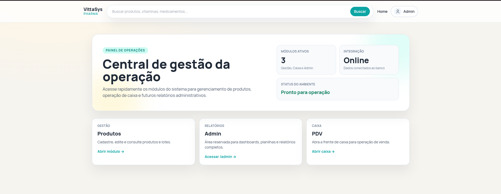

### Gestão de produtos (Blade)
Visão geral da gestão de produtos, com listagem e ações principais.
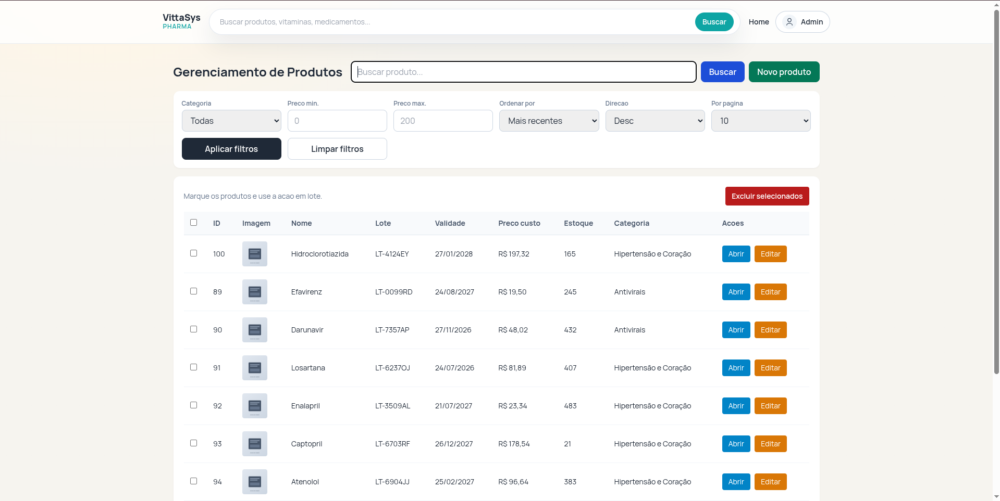

Tela de cadastro de produto.
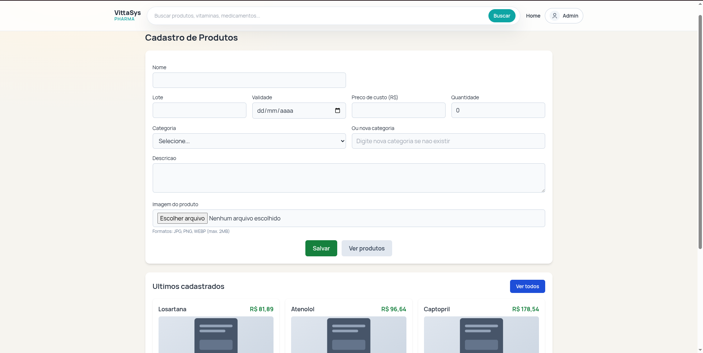

Tela de edição de produto.
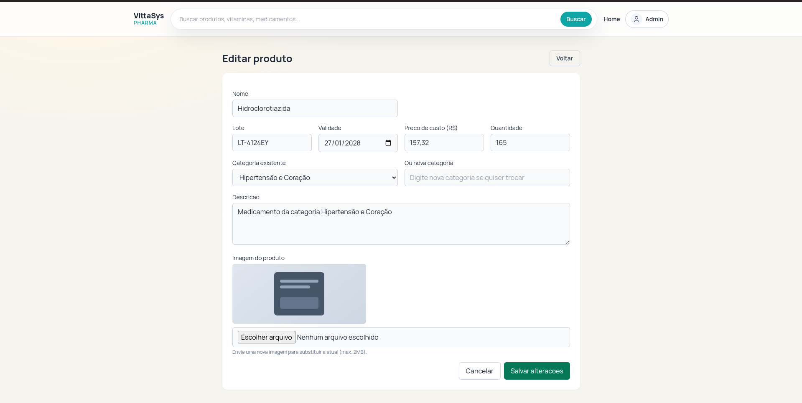

Tela de detalhes do produto com informações e lote atual.
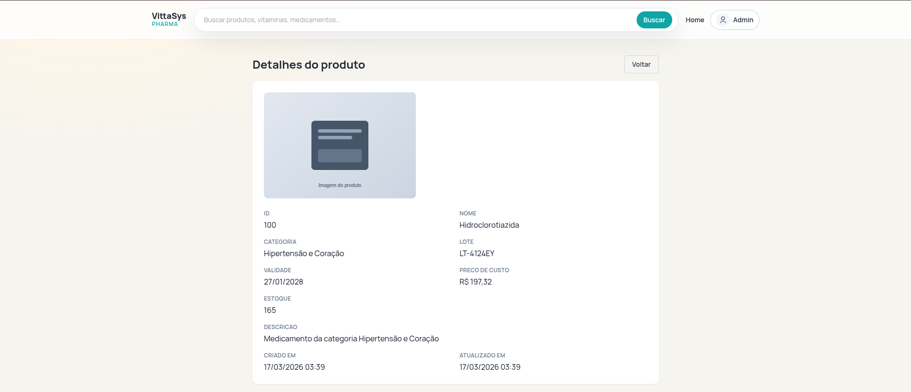

### PDV / Caixa
Tela do PDV com caixa aberto, busca de produtos e resumo do caixa.
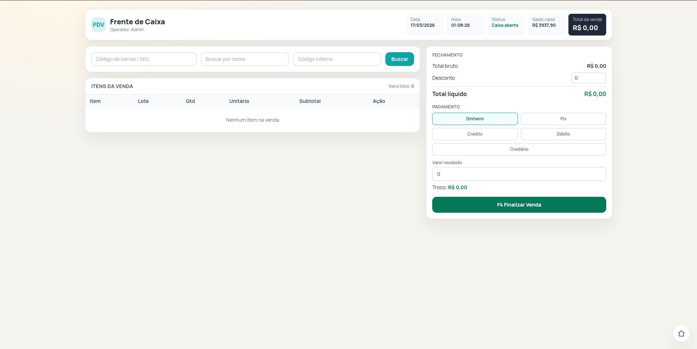

Tela de pagamento com PIX e QR Code.
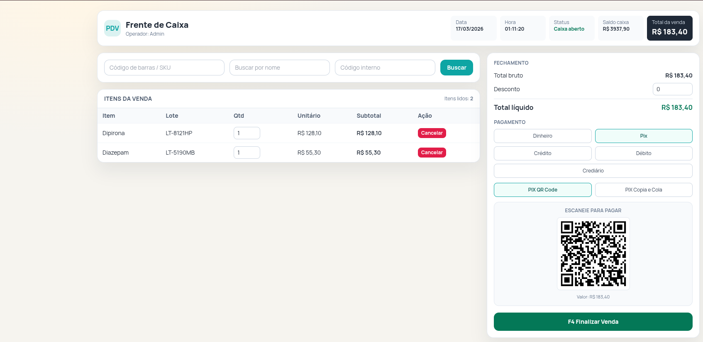

Tela de pagamento com cartão de crédito/débito.
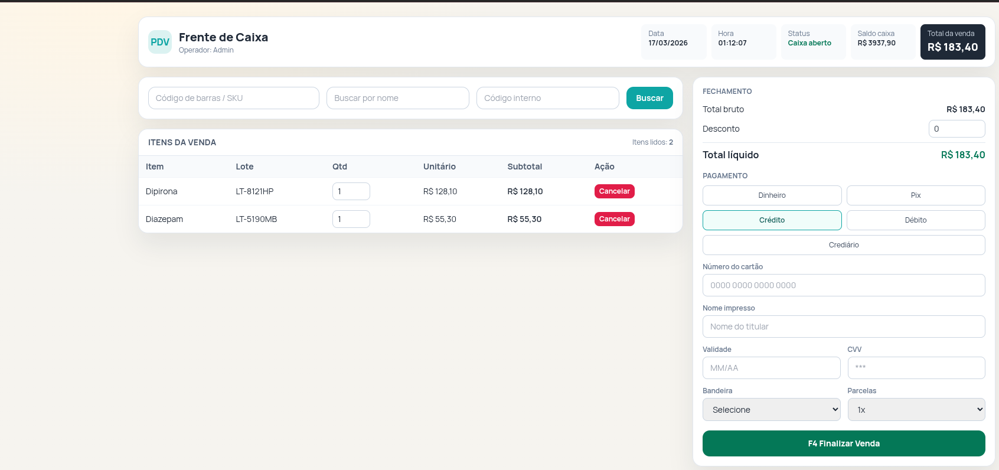

### Filament Admin
Dashboard administrativo do Filament.
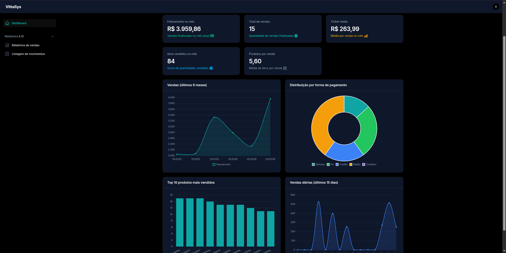

Relatório de vendas no Filament.
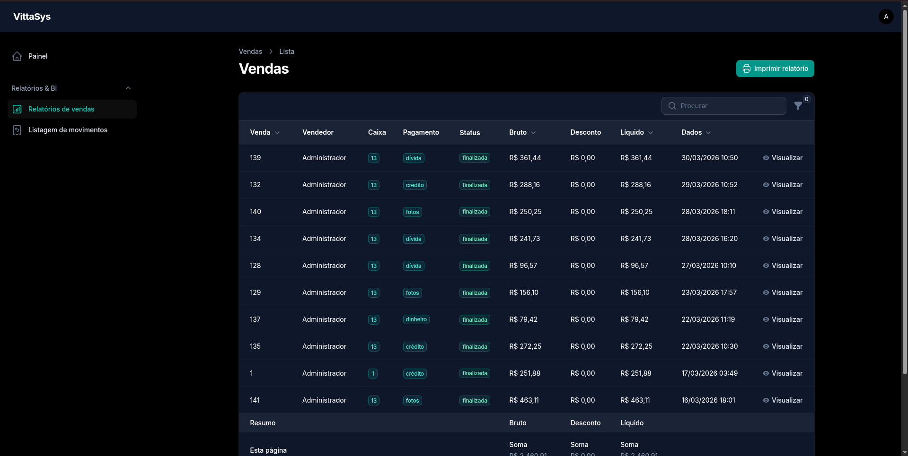

Listagem de itens vendidos (movimentos).
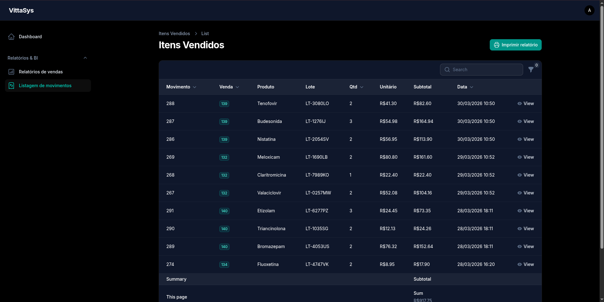

## Usuário padrão de desenvolvimento
Gerado no `DatabaseSeeder`:
- E-mail: `admin@vittasys.com`
- Senha: `123456`

## Variáveis importantes no `.env`
- `APP_NAME`, `APP_URL`, `APP_ENV`
- Configuração de banco (`DB_*`)
- Stripe:
  - `STRIPE_KEY`
  - `STRIPE_SECRET`

## Solução de problemas comuns

### Erro: `Please provide a valid cache path.`
Execute:
```bash
mkdir -p storage/framework/{cache,sessions,views} bootstrap/cache
php artisan optimize:clear
```

### Warning: `PHP_CLI_SERVER_WORKERS`
Para usar workers locais com `php artisan serve`, rode com `--no-reload`.

## Roadmap de melhorias futuras

### Curto prazo
- Fluxo completo de pagamento real (PIX/QR, cartão) integrado ao `StripePaymentService`
- Validação antifraude e logs de tentativa de pagamento
- Fechamento de caixa com conferência e justificativa de diferença
- Melhorias de UX no PDV (atalhos reais, foco de leitura e operação por teclado)

### Médio prazo
- Impressão térmica de comprovante/cupom
- Exportação avançada (PDF/Excel) com filtros salvos
- Permissões por perfil (caixa, gerente, admin)
- Auditoria de ações críticas (vendas, cancelamentos, alterações de estoque)

### BI e relatórios
- Ticket médio por período e por operador
- Margem bruta por venda/produto
- Curva ABC de produtos
- Ruptura e giro de estoque por lote
- Comparativo entre períodos (D-7, D-30, mês atual vs anterior)

### Integrações futuras
- Emissão fiscal (NFC-e/SAT/NF-e) via provedor
- Integração com marketplaces/e-commerce
- Webhooks para conciliação automática de pagamentos
- Filament com relatórios executivos adicionais e agendamentos

## Observações
- A gestão de estoque operacional permanece no fluxo Blade de produtos.
- O Filament está focado em **admin, BI e relatórios**, mantendo separação clara entre operação e gestão.
